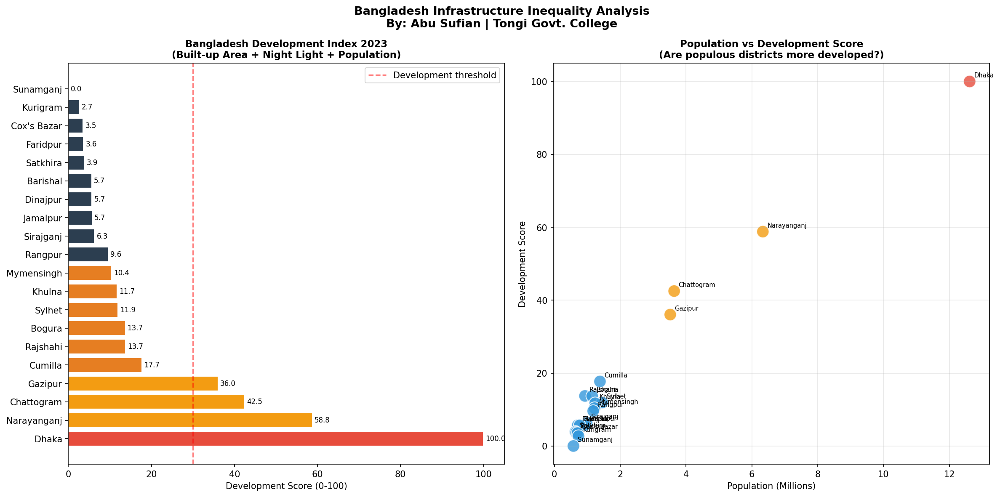

# 🏗️ Bangladesh Infrastructure Inequality Analysis


## 📌 Overview

This project builds a **Bangladesh Development Index** by combining
three satellite-derived indicators across 20 major districts:

- 🏙️ Built-up area density (GHSL 2020)
- 🌙 Night light intensity (VIIRS 2023)
- 👥 Population distribution (WorldPop 2020)

**Key Finding: 100-point development gap between Dhaka and Sunamganj
— revealing extreme inequality across Bangladesh.**

---

## 🔬 Key Research Findings

### Development Index Rankings
| Rank | District | Score | Category |
|---|---|---|---|
| 1 | Dhaka | 100.0 | Highly Developed |
| 2 | Narayanganj | 58.8 | Developing |
| 3 | Chattogram | 42.5 | Developing |
| 4 | Gazipur | 36.0 | Developing |
| ... | ... | ... | ... |
| 18 | Cox's Bazar | 3.5 | Severely Underdeveloped |
| 19 | Kurigram | 2.7 | Severely Underdeveloped |
| 20 | Sunamganj | 0.0 | Severely Underdeveloped |

### Critical Findings
| Metric | Value |
|---|---|
| Development Gap | 100 points (Dhaka vs Sunamganj) |
| Highly Developed Districts | 1 out of 20 |
| Severely Underdeveloped | 10 out of 20 |
| Most Developed | Dhaka (100.0) |
| Least Developed | Sunamganj (0.0) |

> Only 1 district (Dhaka) qualifies as "Highly Developed"
> while 10 out of 20 districts are "Severely Underdeveloped"
> — revealing extreme centralization of development in Bangladesh.

---

## 🗺️ Visualization



---

## 🔬 Methodology

### Data Sources
| Dataset | Source | Purpose |
|---|---|---|
| GHS Built-up Surface | JRC/GHSL/P2023A | Infrastructure density |
| VIIRS Night Lights | NOAA/VIIRS/DNB | Economic activity |
| Population Grid | WorldPop/GP/100m | Population distribution |

### Development Index Formula
```
Development Index =
  (Built-up Score × 0.4) +
  (Night Light Score × 0.4) +
  (Population Score × 0.2)
```

### Categories
| Score | Category |
|---|---|
| 60-100 | Highly Developed |
| 30-59 | Developing |
| 10-29 | Underdeveloped |
| 0-9 | Severely Underdeveloped |

---

## 🛠️ Tools & Technologies

| Tool | Purpose |
|---|---|
| Google Earth Engine | Satellite data processing |
| GHSL 2020 | Built-up area mapping |
| VIIRS Night Lights | Economic activity proxy |
| WorldPop | Population distribution |
| Python + scikit-learn | Index calculation |
| matplotlib | Visualization |

---

## 📂 Project Structure
```
infrastructure-inequality-bangladesh/
│
├── 07-infrastructure-inequality-bangladesh.ipynb
├── infrastructure_inequality.png
├── README.md
└── .gitignore
```

## 🚀 How to Run

1. Open Google Colab
2. Authenticate Google Earth Engine
3. Run all cells in order
4. Chart auto-saves as PNG

---

## 🔗 Related Projects

This is Part 2 of the **Bangladesh Poverty Intelligence Series:**

| # | Project | Focus |
|---|---|---|
| 6 | Night Light Poverty Mapping | Economic development tracking |
| 7 | Infrastructure Inequality (This) | Development index |
| 8 | Economic Growth Tracker | Future growth prediction |

---

## 👨‍🔬 Researcher

**Abu Sufian**
Class 11 | Tongi Govt. College, Gazipur, Bangladesh
Focus: AI Engineering & Environmental Research
GitHub: [@abusufian-dev](https://github.com/abusufian-dev)

---

## 🎯 Full Research Portfolio

| # | Project | Domain | Status |
|---|---|---|---|
| 1 | Water Quality ML | Environment | ✅ Done |
| 2 | Remote Sensing & AI | Environment | ✅ Done |
| 3 | Flood-Prone Prediction | Disaster | ✅ Done |
| 4 | Flood Risk Checker App | Disaster | ✅ Live |
| 5 | Flood Early Warning | Disaster | ✅ Done |
| 6 | Night Light Poverty Map | Society | ✅ Done |
| 7 | Infrastructure Inequality | Society | ✅ Done |
| 8 | Economic Growth Tracker | Society | 🔜 Next |
